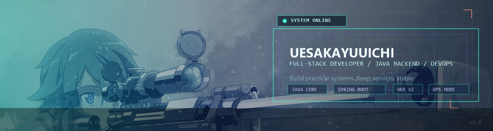

<div align="center">




# UESAKAYUUICHI

### `System Role: Full-Stack Developer`
### `Primary Path: Java Backend / DevOps / Frontend Support`
### `定位：以后端为核心，能落地、能排障、能交付的开发者`

<p>
  
  
  
  
  
</p>

**`Status:` Online**  
**`Mission:` Build stable services, solve real problems, keep shipping.**

</div>

---

## PROFILE.sys

```yaml
name: UESAKAYUUICHI
role: Full-Stack Developer
core_focus:
  - Java Backend Development
  - API Design and Maintenance
  - Deployment and Operations Support
current_state: Leveling up through real-world engineering
```

我主要聚焦 **Java 后端开发**，同时也能处理前端支持、部署流程和线上问题排查。  
My goal is not just to make things work, but to make them **stable, maintainable, and production-ready**.

---

## STATUS_BOARD

<div align="center">
  
  
</div>

---

## LOADOUT.exe

```text
[Backend]
Java / Spring Boot / MySQL

[Frontend]
HTML / CSS / Vue

[DevOps]
Linux / Docker / Nginx

[Workflow]
Git / Debugging / Deployment / Maintenance
```

```text
[Style]
冷静分析 / 快速定位 / 持续迭代 / 面向交付
```

---

## QUEST_LOG.md

### Wenzhou Laplace Intelligent Technology Co., Ltd. | Internship Arc 实习篇章

**Class:** Operations Engineer / Java Backend Developer

- Developed and maintained backend interfaces and Java business logic.
- Participated in server maintenance, production troubleshooting, and issue response.
- Assisted with deployment and cross-team support to keep project delivery moving.

---

## SKILL_TREE

- **Backend Combat / 后端作战**: Building APIs, fixing bugs, maintaining service logic
- **Ops Awareness / 运维意识**: Working with Linux, Docker services, and Nginx configuration
- **Full-Stack Support / 全栈补位**: Able to step in on frontend and deployment tasks when needed
- **Growth Mode / 成长模式**: Continuously improving code quality, engineering habits, and system thinking

---

## CURRENT_MISSION

- Refactor code into something cleaner than yesterday
- Improve debugging speed and troubleshooting accuracy
- Strengthen engineering fundamentals for larger-scale systems
- 从“会写代码”升级到“能稳定交付工程结果”

---

## CONTACT.link

- Email: `2359739818@qq.com`
- Steam: `UESAKAYUUICHI`

---

## FINAL_LINE

> Style gets attention. Stability earns respect.  
> 风格让人记住你，稳定性让人真正认可你。
